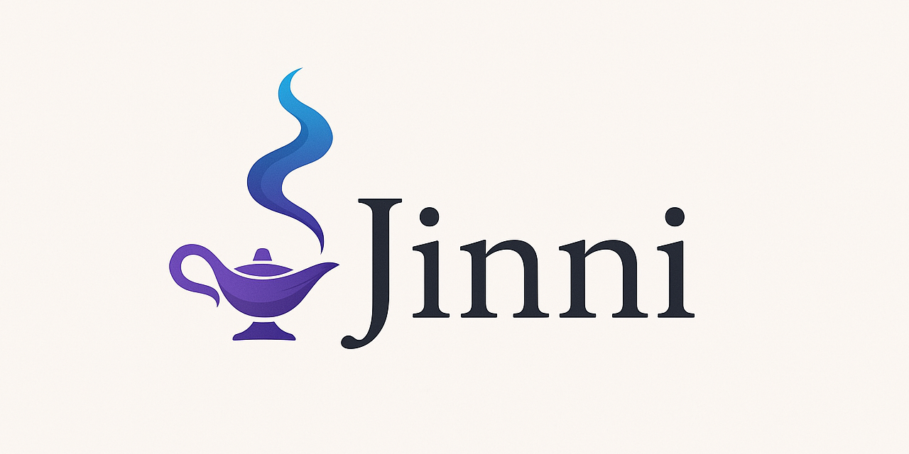

# Jinni: Bring Your Project Into Context

Jinni is a tool to efficiently provide Large Language Models the context of your projects. It gives a consolidated view of relevant project files complete with metadata, overcoming the limitations and inefficiencies of reading files one by one.

The philosophy behind this tool is that LLM context windows are large, models are smart, and directly seeing your project best equips the model to help with anything you throw at it.

Jinni achieves this through two main components: an MCP (Model Context Protocol) server for integration with AI tools and a command-line utility (CLI) for manual use that copies project context to the clipboard ready to paste wherever you need it.

The tools are opinionated about what counts as relevant project context to best work out of the box in most use cases, automatically excluding:
    * Binary files
    * Dotfiles and hideen directories
    * Common naming conventions for logs, build directories, tempfiles, etc

This is customizable on a global and per-directory basis if desired.


## Components

1.  **`jinni` MCP Server:**
    *   Integrates with MCP clients like Cursor, Cline, Roo, Claude Desktop, etc.
    *   Exposes a `read_context` tool that returns a concatenated string of relevant file contents from a specified project directory.

2.  **`jinni` CLI:**
    *   A command-line tool for manually generating the project context dump.
    *   Useful feeding context to LLMs via copy-paste or file input. Or pipe the output wherever you need it.

3.  **`jinni usage` / `usage` Tool:**
    *   A simple command (`jinni usage` via CLI) or MCP tool (`usage`) that displays the content of this README file. Useful for quick reference within the terminal or via an MCP client.

## Features

*   **Efficient Context Gathering:** Reads and concatenates relevant project files in one operation.
*   **Intelligent Filtering (Gitignore-Style Inclusion):**
    *   Uses a system based on `.gitignore` syntax (`pathspec` library's `gitwildmatch`).
    *   Supports hierarchical configuration using `.contextfiles` placed within your project directories. Rules are applied dynamically based on the file/directory being processed.
    *   **Overrides:** Supports `--overrides` (CLI) or `rules` (MCP) to use a specific set of rules exclusively. When overrides are active, both built-in default rules and any `.contextfiles` are ignored.
    *   **Explicit Target Inclusion:** Files/directories explicitly provided as input paths are *always* included/traversed.
   *   **Customizable Configuration (`.contextfiles` / Overrides):**
       *   Define precisely which files/directories to include or exclude using `.gitignore`-style patterns.
       *   Patterns starting with `!` negate the match (an exclusion pattern). (See Configuration section below).
*   **Large Context Handling:** Aborts with a `DetailedContextSizeError` if the total size of included files exceeds a configurable limit (default: 100MB). The error message includes a list of the 10 largest files contributing to the size, helping you identify candidates for exclusion. See the Troubleshooting section for guidance on managing context size.
*   **Metadata Headers:** Output includes file path, size, and modification time for each included file (can be disabled with `list_only`).
*   **Encoding Handling:** Attempts multiple common text encodings (UTF-8, Latin-1, etc.).
*   **List Only Mode:** Option to only list the relative paths of files that would be included, without their content.

## Usage

### MCP Server (`read_context` tool)

1.  **Setup:** Configure your MCP client (e.g., Claude Desktop's `claude_desktop_config.json`) to run the `jinni` server via `uvx`.
2.  **Invocation:** When interacting with your LLM via the MCP client, the model can invoke the `read_context` tool.
    *   **`project_root` (string, required):** The absolute path to the project root directory. Rule discovery and output paths are relative to this root.
    *   **`targets` (JSON array of strings, required):** Specifies a **mandatory** list of file(s)/director(y/ies) within `project_root` to process. Must be a JSON array of string paths (e.g., `["path/to/file1", "path/to/dir2"]`). Paths can be absolute or relative to CWD. All target paths must resolve to locations inside `project_root`. If an empty list `[]` is provided, the entire `project_root` is processed.
    *   **`rules` (JSON array of strings, required):** A **mandatory** list of inline filtering rules (using `.gitignore`-style syntax, e.g., `["src/**/*.py", "!*.tmp"]`). Provide an empty list `[]` if no specific rules are needed (this will use built-in defaults). If non-empty, these rules are used exclusively, ignoring built-in defaults and `.contextfiles`.
    *   **`list_only` (boolean, optional):** If true, returns only the list of relative file paths instead of content.
    *   **`size_limit_mb` (integer, optional):** Override the context size limit in MB.
    *   **`debug_explain` (boolean, optional):** Enable debug logging on the server.
    3.  **Output:** The tool returns a single string containing the concatenated content (with headers) or the file list. Paths in headers/lists are relative to the provided `project_root`. In case of a context size error, it returns a `DetailedContextSizeError` with details about the largest files.

### MCP Server (`usage` tool)

*   **Invocation:** The model can invoke the `usage` tool (no arguments needed).
*   **Output:** Returns the content of the `README.md` file as a string.

*(Detailed server setup instructions will vary depending on your MCP client. Generally, you need to configure the client to execute the Jinni server.)*

**Running the Server:**

*   **Recommended Method:** Use `uvx` to run the server entry point directly (requires the `jinni` package to be published on PyPI or findable by `uvx`):
    ```bash
    uvx jinni-server [OPTIONS]
    ```
    Example MCP client configuration (e.g., `claude_desktop_config.json`):
    ```json
    {
      "mcpServers": {
        "jinni": {
          "command": "uvx jinni-server"
          // Optionally constrain the server root:
          // "command": "uvx jinni-server --root /absolute/path/"
        }
      }
    }
    ```

*   **During local development (after `uv pip install -e .`):** Use `python -m` to run the server module directly:
    ```bash
    python -m jinni.server [OPTIONS]
    ```
    Example MCP client configuration for local development:
    ```json
    {
      "mcpServers": {
        "jinni": {
          // Adjust python path if needed, or ensure the correct environment is active
          "command": "python -m jinni.server"
          // Optionally constrain the server root:
          // "command": "python -m jinni.server --root /absolute/path/to/repo"
        }
      }
    }
    ```

*Consult your specific MCP client's documentation for precise setup steps. Ensure `uv` (for `uvx`) or the correct Python environment (for `python -m`) is accessible. The `usage` tool corresponds to the `jinni usage` CLI command.*

### Command-Line Utility (`jinni` CLI)

```bash
jinni [OPTIONS] [<PATH...>]
```

*   **`<PATH...>` (optional):** One or more paths to the project directories or files to analyze. Defaults to the current directory (`.`) if none are provided.
*   **`-r <DIR>` / `--root <DIR>` (optional):** Specify the project root directory. If provided, rule discovery starts here, and output paths are relative to this directory. If omitted, the root is inferred from the common ancestor of the `<PATH...>` arguments (or CWD if only '.' is processed).
*   **`--output <FILE>` / `-o <FILE>` (optional):** Write the output to `<FILE>` instead of printing to standard output.
*   **`--list-only` / `-l` (optional):** Only list the relative paths of files that would be included.
*   **`--overrides <FILE>` (optional):** Use rules from `<FILE>` instead of discovering `.contextfiles`.
*   **`--size-limit-mb <MB>` / `-s <MB>` (optional):** Override the maximum context size in MB.
*   **`--debug-explain` (optional):** Print detailed inclusion/exclusion reasons to stderr and `jinni_debug.log`.
*   **`--root <DIR>` / `-r <DIR>` (optional):** See above.
*   **`--no-copy` (optional):** Prevent automatically copying the output content to the system clipboard when printing to standard output (the default is to copy).

### Command-Line Utility (`jinni usage`)

```bash
jinni usage
```

*   Displays the content of this README file to standard output.

### Installation

You can install Jinni using `pip` or `uv`:

**Using pip:**
```bash
pip install jinni
```

**Using uv:**
```bash
uv pip install jinni
```

This will make the `jinni` CLI command available in your environment. See the "Running the Server" section above for how to start the MCP server depending on your installation method.

### Examples

*   **Dump context of `my_project/` to the console:**
    ```bash
    jinni ./my_project/ # Process a single directory
    jinni ./src ./docs/README.md # Process multiple targets
    jinni # Process current directory (.)
    ```

*   **List files that would be included in `my_project/` without content:**
    ```bash
    jinni -l ./my_project/
    jinni --list-only ./src ./docs/README.md
    ```

*   **Dump context of `my_project/` to a file named `context_dump.txt`:**
    ```bash
    jinni -o context_dump.txt ./my_project/
    ```

*   **Use override rules from `custom.rules` instead of `.contextfiles`:**
    ```bash
    jinni --overrides custom.rules ./my_project/
    ```
*   **Show debug information:**
    ```bash
    jinni --debug-explain ./src
    ```
*   **Dump context (output is automatically copied to clipboard by default):**
    ```bash
    jinni ./my_project/
    ```
*   **Dump context but *do not* copy to clipboard:**
    ```bash
    jinni --no-copy ./my_project/
    ```

## Configuration (`.contextfiles` & Overrides)

Jinni uses `.contextfiles` (or an override file) to determine which files and directories to include or exclude, based on `.gitignore`-style patterns.

*   **Core Principle:** Rules are applied dynamically during traversal. The effective rules for any given file/directory depend on the `.contextfiles` found in its parent directories (up to a common root) or the override rules.
*   **Location (`.contextfiles`):** Place `.contextfiles` in any directory. Rules apply to that directory and its subdirectories, inheriting rules from parent directories.
*   **Format:** Plain text, UTF-8 encoded, one pattern per line.
*   **Syntax:** Uses standard `.gitignore` pattern syntax (specifically `pathspec`'s `gitwildmatch` implementation).
    *   **Comments:** Lines starting with `#` are ignored.
    *   **Inclusion Patterns:** Specify files/directories to include (e.g., `src/**/*.py`, `*.md`, `/config.yaml`).
    *   **Exclusion Patterns:** Lines starting with `!` indicate that a matching file should be excluded (negates the pattern).
    *   **Anchoring:** A leading `/` anchors the pattern to the directory containing the `.contextfiles`.
    *   **Directory Matching:** A trailing `/` matches directories only.
    *   **Wildcards:** `*`, `**`, `?` work as in `.gitignore`.
*   **Rule Application Logic:**
    1.  **Override Check:** If `--overrides` (CLI) or `rules` (MCP) are provided, these rules are used exclusively. All `.contextfiles` and built-in defaults are ignored.
    2.  **Dynamic Context Rules (No Overrides):** When processing a file or directory, Jinni:
        *   Finds all `.contextfiles` starting from a common root directory down to the current item's directory.
        *   Combines the rules from these files (parent rules first, child rules last) along with built-in default rules.
        *   Compiles these combined rules into a temporary specification (`PathSpec`).
        *   Matches the current file/directory path (relative to the common root) against this specification.
    3.  **Matching:** The **last pattern** in the combined rule set that matches the item determines its fate. If the last matching pattern starts with `!`, the item is excluded. Otherwise, it's included. If no user-defined pattern in the combined rule set matches the item, it is included *unless* it matches one of the built-in default exclusion patterns (e.g., `.git/`, `node_modules/`, common binary extensions). If no pattern matches at all (neither user nor default), the item is included.
    4.  **Target Handling:** If specific `targets` are provided (CLI or MCP), they are validated to be within the `project_root`. If a target is a file, only that file is processed (rule checks don't apply to the target file itself, but binary/size checks do). If a target is a directory, the walk starts there, but rules are still applied relative to the `project_root`.

### Examples (`.contextfiles`)

**Example 1: Include Python Source and Root Config**

Located at `my_project/.contextfiles`:

```
# Include all Python files in the src directory and subdirectories
src/**/*.py

# Include the main config file at the root of the project
/config.json

# Include all markdown files anywhere
*.md

# Exclude any test data directories found anywhere
!**/test_data/
```

**Example 2: Overriding in a Subdirectory**

Located at `my_project/src/.contextfiles`:

```
# In addition to rules inherited from parent .contextfiles...

# Include specific utility scripts in this directory
utils/*.sh

# Exclude a specific generated file within src, even if *.py is included elsewhere
!generated_parser.py
```

## Development

*   **Design Details:** [DESIGN.md](DESIGN.md)

## Troubleshooting

### Context Size Errors (`DetailedContextSizeError`)

If you encounter an error indicating the context size limit was exceeded, Jinni will provide a list of the 10 largest files it attempted to include. This helps you identify potential candidates for exclusion.

**To resolve this:**

1.  **Review the Largest Files:** Check the list provided in the error message. Are there large files (e.g., data files, logs, build artifacts, media) that shouldn't be part of the LLM's context?
2.  **Configure Exclusions:** Use `.contextfiles` or the `--overrides` / `rules` options to exclude unnecessary files or directories.
    *   **Example (`.contextfiles`):** To exclude all `.log` files and a specific large data directory:
        ```
        # Exclude all log files
        !*.log

        # Exclude a large data directory
        !large_data_files/
        ```
    *   Refer to the **Configuration** section above for detailed syntax and usage.
3.  **Increase the Limit (Use with Caution):** If all included files are genuinely necessary, you can increase the size limit using `--size-limit-mb` (CLI) or `size_limit_mb` (MCP). Be mindful of LLM context window limits and processing costs.
4.  **Use `jinni usage` / `usage`:** If you need to refer back to these instructions or the configuration details while troubleshooting, use the `jinni usage` command or the `usage` MCP tool.