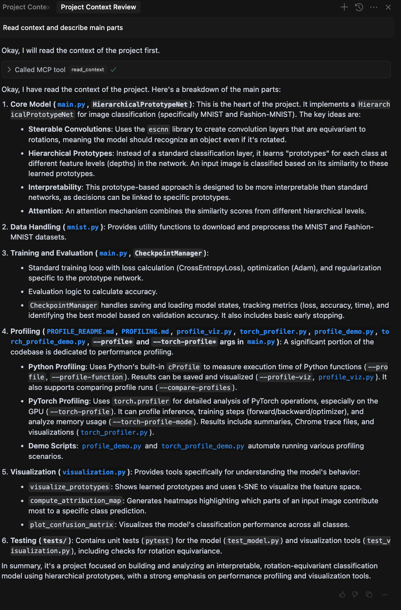

# Jinni: Bring Your Project Into Context

<a href="https://glama.ai/mcp/servers/@smat-dev/jinni">
  
</a>

Jinni is a tool to efficiently provide Large Language Models the context of your projects. It gives a consolidated view of relevant project files, overcoming the limitations and inefficiencies of reading files one by one. Each file's content is preceded by a simple header indicating its path:

```
```path=src/app.py
print("hello")
```

The philosophy behind this tool is that LLM context windows are large, models are smart, and directly seeing your project best equips the model to help with anything you throw at it.

There is an MCP (Model Context Protocol) server for integration with AI tools and a command-line utility (CLI) for manual use that copies project context to the clipboard ready to paste wherever you need it.

These tools are opinionated about what counts as relevant project context to best work out of the box in most use cases, automatically excluding:

    * Binary files
    * Dotfiles and hidden directories
    * Common naming conventions for logs, build directories, tempfiles, etc

Inclusions/exclusions are customizable with complete granularity if required using `.contextfiles` – this works like `.gitignore` except defining inclusions. `.gitignore` files themselves are also respected automatically, but any rules in `.contextfiles` take priority.

The MCP server can provide as much or as little of the project as desired. By default the scope is the whole project, but the model can ask for specific modules / matching patterns / etc.

# MCP Quickstart

MCP server config file for Cursor / Roo / Claude Desktop / client of choice:

```json
{
    "mcpServers": {
        "jinni": {
            "command": "uvx",
            "args": ["jinni-server"]
        }
    }
}
```

*You can optionally constrain the server to only read within a tree for security in case your LLM goes rogue: add `"--root", "/absolute/path/"` to the `args` list.*

Install uv if it is not on your system: https://docs.astral.sh/uv/getting-started/installation/

Reload your IDE and you can now ask the agent to read in context.

If you want to restrict this to particular modules / paths just ask - e.g. "Read context for tests".

In action with Cursor:



# Note For Cursor Users

Cursor can silently drop context that is larger than the allowed maximum, so if you have a sizable project and the agent acts like the tool call never happened, try reducing what you are bringing in ("read context for xyz")

## Components

1.  **`jinni` MCP Server:**
    *   Integrates with MCP clients like Cursor, Cline, Roo, Claude Desktop, etc.
    *   Exposes a `read_context` tool that returns a concatenated string of relevant file contents from a specified project directory.

2.  **`jinni` CLI:**
    *   A command-line tool for manually generating the project context dump.
    *   Useful for feeding context to LLMs via copy-paste or file input. Or pipe the output wherever you need it.

## Features

*   **Efficient Context Gathering:** Reads and concatenates relevant project files in one operation.
*   **Intelligent Filtering (Gitignore-Style Inclusion):**
    *   Uses a system based on `.gitignore` syntax (`pathspec` library's `gitwildmatch`).
    *   Automatically loads `.gitignore` files from the project root downward. These exclusions can be overridden by rules in `.contextfiles`.
    *   Supports hierarchical configuration using `.contextfiles` placed within your project directories. Rules are applied dynamically based on the file/directory being processed.
    *   **Matching Behavior:** Patterns match against the path relative to the **target directory** being processed (or the project root if no specific target is given). For example, if targeting `src/`, a rule `!app.py` in `src/.contextfiles` will match `app.py`. Output paths remain relative to the original project root.
    *   **Overrides:** Supports `--overrides` (CLI) or `rules` (MCP) to use a specific set of rules exclusively. When overrides are active, both built-in default rules and any `.contextfiles` are ignored. Path matching for overrides is still relative to the target directory.
    *   **Explicit Target Inclusion:** Files explicitly provided as targets are always included (bypassing rule checks, but not binary/size checks). Directories explicitly provided as targets are always entered, and rule discovery/matching then proceeds relative to that target directory.
   *   **Customizable Configuration (`.contextfiles` / Overrides):**
        *   Define precisely which files/directories to include or exclude using `.gitignore`-style patterns applied to the **relative path**.
        *   Patterns starting with `!` negate the match (an exclusion pattern). (See Configuration section below).
*   **Large Context Handling:** Aborts with a `DetailedContextSizeError` if the total size of included files exceeds a configurable limit (default: 100MB). The error message includes a list of the 10 largest files contributing to the size, helping you identify candidates for exclusion. See the Troubleshooting section for guidance on managing context size.
*   **Metadata Headers:** Output includes a path header for each included file (e.g., ````path=src/app.py`). This can be disabled with `list_only`.
*   **Encoding Handling:** Attempts multiple common text encodings (UTF-8, Latin-1, etc.).
*   **List Only Mode:** Option to only list the relative paths of files that would be included, without their content.

## Usage

### MCP Server (`read_context` tool)

1.  **Setup:** Configure your MCP client (e.g., Claude Desktop's `claude_desktop_config.json`) to run the `jinni` server via `uvx`.
2.  **Invocation:** When interacting with your LLM via the MCP client, the model can invoke the `read_context` tool.
    *   **`project_root` (string, required):** The absolute path to the project root directory. Rule discovery and output paths are relative to this root.
    *   **`targets` (JSON array of strings, required):** Specifies a **mandatory** list of file(s)/directory/ies within `project_root` to process. Must be a JSON array of string paths (e.g., `["path/to/file1", "path/to/dir2"]`). Paths can be absolute or relative to CWD. All target paths must resolve to locations inside `project_root`. If an empty list `[]` is provided, the entire `project_root` is processed.
    *   **`rules` (JSON array of strings, required):** A **mandatory** list of inline filtering rules (using `.gitignore`-style syntax, e.g., `["src/**/*.py", "!*.tmp"]`). Provide an empty list `[]` if no specific rules are needed (this will use built-in defaults). If non-empty, these rules are used exclusively, ignoring built-in defaults and `.contextfiles`.
    *   **`list_only` (boolean, optional):** If true, returns only the list of relative file paths instead of content.
    *   **`size_limit_mb` (integer, optional):** Override the context size limit in MB.
    *   **`debug_explain` (boolean, optional):** Enable debug logging on the server.
    *   **`exclusions` (object, optional):** Exclusion configuration with three optional fields:
        *   **`global`** (array of strings): Keywords to exclude globally (e.g., `["tests", "deprecated"]`)
        *   **`scoped`** (object): Map of paths to keyword arrays for scoped exclusions (e.g., `{"src/legacy": ["old", "deprecated"]}`)
        *   **`patterns`** (array of strings): File patterns to exclude (e.g., `["*.test.js", "*_old.*"]`)
    3.  **Output:** The tool returns a single string containing the concatenated content (with headers) or the file list. Paths in headers/lists are relative to the provided `project_root`. In case of a context size error, it returns a `DetailedContextSizeError` with details about the largest files.

### MCP Server (`usage` tool)

*   **Invocation:** The model can invoke the `usage` tool (no arguments needed).
*   **Output:** Returns the content of the `README.md` file as a string.

*(Detailed server setup instructions will vary depending on your MCP client. Generally, you need to configure the client to execute the Jinni server.)*

**Running the Server:**

*   **Recommended Method:** Use `uvx` to run the server entry point directly (requires the `jinni` package to be published on PyPI or findable by `uvx`):
    ```bash
    uvx jinni-server [OPTIONS]
    ```
    Example MCP client configuration (e.g., `claude_desktop_config.json`):
    ```json
    {
      "mcpServers": {
        "jinni": {
          "command": "uvx",
          "args": ["jinni-server"]
        }
      }
    }
    ```

*You can optionally constrain the server to only read within a tree for security in case your LLM goes rogue: add `"--root", "/absolute/path/"` to the `args` list.*

*See your specific MCP client's documentation for precise setup steps. Ensure `uv` is installed*

### Command-Line Utility (`jinni` CLI)

```bash
jinni [OPTIONS] [<PATH...>]
```

*   **`<PATH...>` (optional):** One or more paths to the project directories or files to analyze. Defaults to the current directory (`.`) if none are provided.
*   **`-r <DIR>` / `--root <DIR>` (optional):** Specify the project root directory. If provided, rule discovery starts here, and output paths are relative to this directory. If omitted, the root is inferred from the common ancestor of the `<PATH...>` arguments (or CWD if only '.' is processed).
*   **`--output <FILE>` / `-o <FILE>` (optional):** Write the output to `<FILE>` instead of printing to standard output.
*   **`--list-only` / `-l` (optional):** Only list the relative paths of files that would be included.
*   **`--overrides <FILE>` (optional):** Add rules from `<FILE>` as high-priority rules in addition to `.contextfiles` and `.gitignore`.
*   **`--size-limit-mb <MB>` / `-s <MB>` (optional):** Override the maximum context size in MB.
*   **`--debug-explain` (optional):** Print detailed inclusion/exclusion reasons to stderr and `jinni_debug.log`.
*   **`--root <DIR>` / `-r <DIR>` (optional):** See above.
*   **`--no-copy` (optional):** Prevent automatically copying the output content to the system clipboard when printing to standard output (the default is to copy).
*   **`--not <keyword>` (optional, repeatable):** Exclude modules/directories matching keyword (e.g., `--not tests --not vendor`). Can be used multiple times.
*   **`--not-in <path:keywords>` (optional, repeatable):** Exclude specific keywords within a path (e.g., `--not-in src/legacy:old,deprecated`). Can be used multiple times.
*   **`--not-files <pattern>` (optional, repeatable):** Exclude files matching pattern (e.g., `--not-files '*.test.js' --not-files '*_old.*'`). Can be used multiple times.
*   **`--keep-only <modules>` (optional):** Keep only specified modules/directories, exclude everything else (comma-separated, e.g., `--keep-only src,lib,docs`).

### Exclusion Examples

**CLI Examples:**

```bash
# Exclude all test directories
jinni --not tests

# Exclude multiple keywords
jinni --not tests --not vendor --not deprecated

# Exclude old code only in specific paths
jinni --not-in src/legacy:old,deprecated --not-in lib/v1:legacy

# Exclude specific file patterns
jinni --not-files "*.test.js" --not-files "*_old.*"

# Keep only src and docs, exclude everything else
jinni --keep-only src,docs

# Combine different exclusion types
jinni --not tests --not-in src/experimental:wip --not-files "*.bak"
```

**Note:** Exclusion commands (`--not*` flags) work in addition to existing `.gitignore` and `.contextfiles` rules. They further filter down what would otherwise be included.

**MCP Examples:**

```json
{
  "project_root": "/path/to/project",
  "targets": [],
  "rules": [],
  "exclusions": {
    "global": ["tests", "vendor"],
    "scoped": {
      "src/legacy": ["old", "deprecated"],
      "lib/experimental": ["wip", "unstable"]
    },
    "patterns": ["*.test.js", "*_backup.*"]
  }
}
```

## Installation

You can install Jinni using `pip` or `uv`:

**Using pip:**
```bash
pip install jinni
```

**Using uv:**
```bash
uv pip install jinni
```

This will make the `jinni` CLI command available in your environment. See the "Running the Server" section above for how to start the MCP server depending on your installation method.

## Platform-specific notes

### Windows + WSL
Jinni v0.1.7+ auto-converts WSL paths.  

Provide either of these as `project_root` (CLI `--root` or MCP argument):
```bash
/home/user/project
vscode-remote://wsl+Ubuntu-22.04/home/user/project
```
No wrappers, mounts, or extra flags required—Jinni resolves the UNC path (`\\wsl$\...`) on Windows automatically.

**UNC Path Format:** Jinni always uses `\\wsl$\<distro>\...` for maximum compatibility with all Windows versions supporting WSL.
**Distro Name Handling:** Spaces and most special characters are allowed in the distro name. Only truly illegal UNC characters are replaced with `_`.
**Caching:** WSL path lookups and conversions are cached for performance. If you install WSL while Jinni is running, restart Jinni to pick up the new `wslpath`.
**Opt-out:** Set the environment variable `JINNI_NO_WSL_TRANSLATE=1` to disable all WSL path translation logic.

Only `wsl+<distro>` URIs and absolute POSIX paths (starting with `/`) are translated; for SSH or container remotes, run Jinni inside that environment.

| Runtime OS    | What you pass in                          | What `_translate_wsl_path()` returns      |
|---------------|-------------------------------------------|------------------------------------------|
| **Windows**   | `vscode-remote://wsl%2BUbuntu/home/a/b`   | `\\wsl$\\Ubuntu\home\a\b`              |
| **Windows**   | `/home/a/b`                               | `\\wsl$\\Ubuntu\home\a\b` (via wslpath) |
| **Linux/WSL** | `vscode-remote://wsl+Ubuntu/home/a/b`     | `/home/a/b`                              |
| **Linux/WSL** | `/home/a/b`                               | `/home/a/b` (unchanged)                  |

## Examples

*   **Dump context of `my_project/` to the console:**
    ```bash
    jinni ./my_project/ # Process a single directory
    jinni ./src ./docs/README.md # Process multiple targets
    jinni # Process current directory (.)
    ```

*   **List files that would be included in `my_project/` without content:**
    ```bash
    jinni -l ./my_project/
    jinni --list-only ./src ./docs/README.md
    ```

*   **Dump context of `my_project/` to a file named `context_dump.txt`:**
    ```bash
    jinni -o context_dump.txt ./my_project/
    ```

*   **Use override rules from `custom.rules` instead of `.contextfiles`:**
    ```bash
    jinni --overrides custom.rules ./my_project/
    ```
*   **Show debug information:**
    ```bash
    jinni --debug-explain ./src
    ```
*   **Dump context (output is automatically copied to clipboard by default):**
    ```bash
    jinni ./my_project/
    ```
*   **Dump context but *do not* copy to clipboard:**
    ```bash
    jinni --no-copy ./my_project/
    ```

## Configuration (`.contextfiles` & Overrides)

Jinni uses `.contextfiles` (or an override file) to determine which files and directories to include or exclude, based on `.gitignore`-style patterns.

*   **Core Principle:** Rules are applied dynamically during traversal, relative to the current target directory being processed.
*   **Location (`.contextfiles`):** Place `.contextfiles` in any directory. When processing a directory (either the initial target or a subdirectory), Jinni looks for `.contextfiles` starting from that directory downwards. Rules from parent directories *outside* the current target directory are ignored when processing inside that target.
*   **Format:** Plain text, UTF-8 encoded, one pattern per line.
*   **Syntax:** Uses standard `.gitignore` pattern syntax (specifically `pathspec`'s `gitwildmatch` implementation).
    *   **Comments:** Lines starting with `#` are ignored.
    *   **Inclusion Patterns:** Specify files/directories to include (e.g., `src/**/*.py`, `*.md`, `/config.yaml`).
    *   **Exclusion Patterns:** Lines starting with `!` indicate that a matching file should be excluded (negates the pattern).
    *   **Anchoring:** A leading `/` anchors the pattern to the directory containing the `.contextfiles`.
    *   **Directory Matching:** A trailing `/` matches directories only.
    *   **Wildcards:** `*`, `**`, `?` work as in `.gitignore`.
*   **Rule Application Logic:**
    1.  **Determine Target:** Jinni identifies the target directory (either explicitly provided or the project root).
    2.  **Override Check:** If `--overrides` (CLI) or `rules` (MCP) are provided, these rules are used exclusively. All `.contextfiles` and built-in defaults are ignored. Path matching is relative to the target directory.
    3.  **Dynamic Context Rules (No Overrides):** When processing a file or subdirectory within the target directory:
        *   Jinni finds all `.gitignore` and `.contextfiles` starting from the target directory down to the current item's directory.
        *   Rules from `.gitignore` are applied first, then built-in defaults, and finally any `.contextfiles` (which take precedence).
        *   It compiles these combined rules into a specification (`PathSpec`).
        *   It matches the current file/subdirectory path, calculated *relative to the target directory*, against this specification.
    4.  **Matching:** The **last pattern** in the combined rule set that matches the item's relative path determines its fate. `!` negates the match. If no user-defined pattern matches, the item is included unless it matches a built-in default exclusion (like `!.*`).
    5.  **Target Handling:** Explicitly targeted files bypass rule checks. Explicitly targeted directories become the root for rule discovery and matching for their contents. Output paths always remain relative to the original `project_root`.

### Examples (`.contextfiles`)

**Example 1: Include Python Source and Root Config**

Located at `my_project/.contextfiles`:

```
# Include all Python files in the src directory and subdirectories
src/**/*.py

# Include the main config file at the root of the project
/config.json

# Include all markdown files anywhere
*.md

# Exclude any test data directories found anywhere
!**/test_data/
```

**Example 2: Overriding in a Subdirectory**

Located at `my_project/src/.contextfiles`:

```
# In addition to rules inherited from parent .contextfiles...

# Include specific utility scripts in this directory
utils/*.sh

# Exclude a specific generated file within src, even if *.py is included elsewhere
!generated_parser.py
```

## Development

*   **Design Details:** [DESIGN.md](DESIGN.md)

*   **Running Server Locally:** During development (after installing with `uv pip install -e .` or similar), you can run the server module directly:
    ```bash
    python -m jinni.server [OPTIONS]
    ```
    Example MCP client configuration for local development:
    ```json
    {
      "mcpServers": {
        "jinni": {
          // Adjust python path if needed, or ensure the correct environment is active
          "command": "python -m jinni.server"
          // Optionally constrain the server to only read within a tree (recommended for security):
          // "command": "python -m jinni.server --root /absolute/path/to/repo"
        }
      }
    }
    ```

## Troubleshooting

### Context Size Errors (`DetailedContextSizeError`)

If you encounter an error indicating the context size limit was exceeded, Jinni will provide a list of the 10 largest files it attempted to include. This helps you identify potential candidates for exclusion.

**To resolve this:**

1.  **Review the Largest Files:** Check the list provided in the error message. Are there large files (e.g., data files, logs, build artifacts, media) that shouldn't be part of the LLM's context?
2.  **Configure Exclusions:** Use `.contextfiles` or the `--overrides` / `rules` options to exclude unnecessary files or directories.
    *   **Example (`.contextfiles`):** To exclude all `.log` files and a specific large data directory:
        ```
        # Exclude all log files
        !*.log

        # Exclude a large data directory
        !large_data_files/
        ```
    *   Refer to the **Configuration** section above for detailed syntax and usage.
3.  **Increase the Limit (Use with Caution):** If all included files are genuinely necessary, you can increase the size limit using `--size-limit-mb` (CLI) or `size_limit_mb` (MCP). Be mindful of LLM context window limits and processing costs.
4.  **Use `jinni usage` / `usage`:** If you need to refer back to these instructions or the configuration details while troubleshooting, use the `jinni usage` command or the `usage` MCP tool.